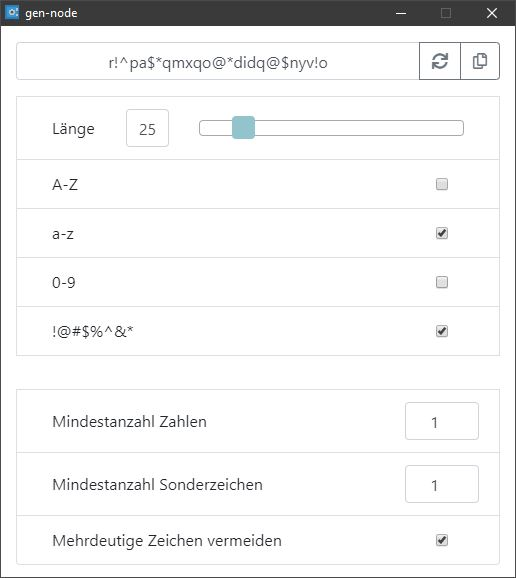

# gen-node

<p align="center">
    
</p>

## Installation

- download from [releases](https://github.com/dix0nym/gen-node/releases)

## Building from source

- ```git clone git@github.com:dix0nym/gen-node.git```

- ```npm install```

